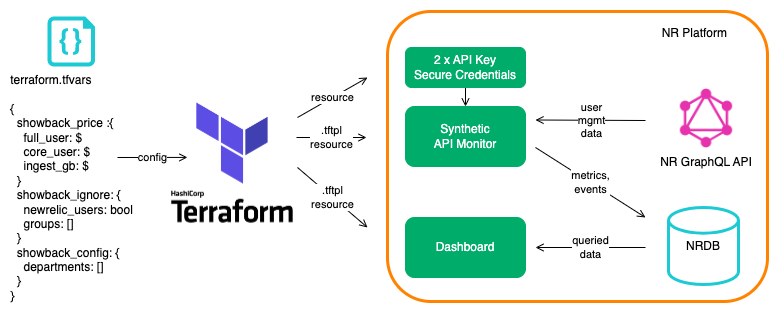
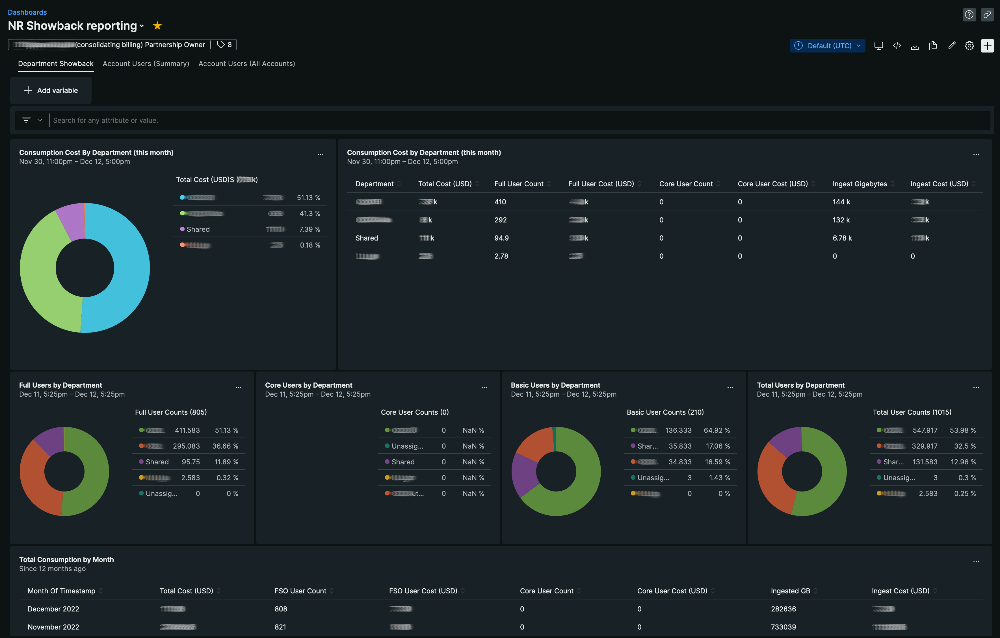
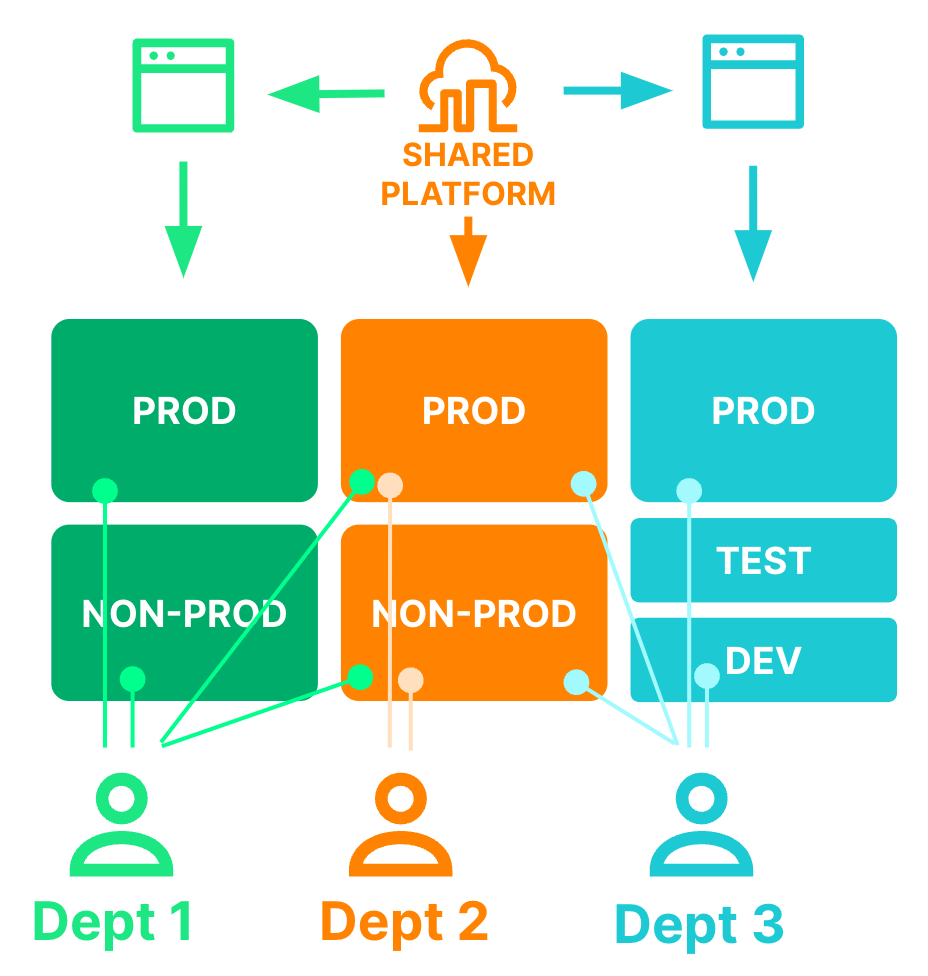
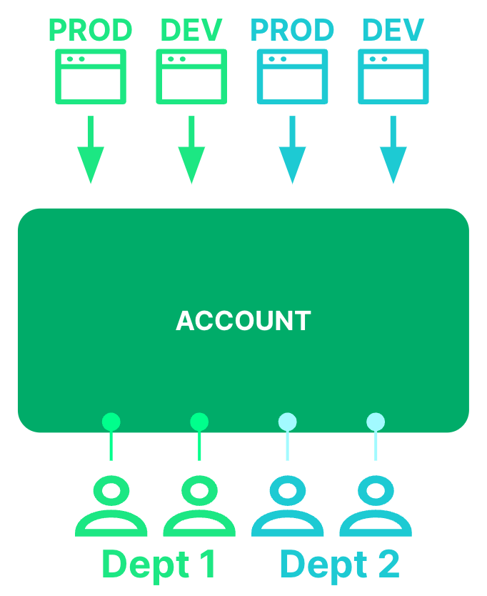

[](https://opensource.newrelic.com/oss-category/#new-relic-experimental)

# nr-showback

This repository provides an automated way to report New Relic ingest consumption and user costs, by business department, using aggregated account-based cost allocation. **Now with advanced proportional cost allocation and synthetics billing** for enterprise contract models.



A single [terraform.tfvars](terraform.tfvars) file contains the definition of departments within a business, a customer's prices for ingest and user consumption, minimum commitment amounts, and the ability to ignore certain groups. Applying the terraform via a wrapper script creates a synthetics script, secure credentials containing API keys, and an associated dashboard. Once every 24 hours, the synthetics script queries the New Relic GraphQL API for a customer's organization and user management data structures. Based upon a model of hierarchical account-based cost allocation, showback data is posted into NRDB as metrics, and user data as custom events. To view the showback data, customers access a dashboard that is built, and kept in sync with the departmental definitions, by terraform configuration.



## ✨ New: Advanced Cost Allocation Features

This solution now supports **sophisticated cost allocation models** for enterprise New Relic contracts:

### 🔄 **Proportional Cost Allocation** 
Departments pay **fair shares** of organizational costs based on their actual usage:
- **Ingest Costs**: When your organization doesn't meet the minimum commitment (e.g., 2,500GB), each department pays their proportional share of the minimum cost
- **Synthetics Costs**: After the included checks (typically 1,000,000), excess costs are allocated proportionally by department usage
- **Real-time Calculations**: Uses live consumption data for accurate, up-to-date cost allocation

- Organization total: 1,800GB (under 2,500GB minimum)
- Organization cost: 2,500GB × $0.40 = $1,000 (minimum commitment)
- Department A usage: 600GB = 33.3% of total
- Department A cost: $1,000 × 33.3% = $333.33
**Example Proportional Ingest Allocation:**
- Organization total: 1,800GB (under 2,500GB minimum)
- Organization cost: 2,500GB × $0.40 = $1,000 (minimum commitment)
- Department A usage: 600GB = 33.3% of total
- Department A cost: $1,000 × 600/1,800 = $333.33
- Organization total: 1,800GB (under 2,500GB minimum)
- Organization cost: 2,500GB × $0.40 = $1,000 (minimum commitment)
- Department A usage: 600GB = 33.3% of total
- Department A cost: $1,000 × 33.3% = $333.33

### 💰 **Synthetics Cost Management**
- **Included Checks**: First 1,000,000 synthetic checks per month are included (configurable based on your contract)
- **Proportional Billing**: Excess checks beyond included amount are charged at $0.005/check (configurable)
- **Department Allocation**: Each department pays their proportional share of total excess costs

**Example Synthetics Allocation:**
- Organization total: 1,500,000 checks
- Included checks: 1,000,000 (per contract)
- Billable checks: 500,000 (above included amount)
- Total cost: 500,000 × $0.005 = $2,500
- Department usage allocation applied proportionally

### 📊 **Minimum Commitment Pricing** 
Different pricing tiers for committed minimums vs. additional usage:

- **Committed Rates**: Different pricing for committed minimums vs. additional usage
- **Flexible Minimums**: Set minimum committed users and data ingest amounts
- **Automatic Calculations**: Dashboard automatically calculates committed costs + additional costs
- **Proportional Minimums**: When organizations are under minimums, costs are allocated proportionally
- **Backward Compatible**: Existing configurations continue to work unchanged

### Quick Example
```hcl
showback_price = {
  # Standard rates (used as fallback)
  core_user_usd = 49        # $49 per core user
  full_user_usd = 99        # $99 per full user
  gb_ingest_usd = 0.40      # $0.40 per GB ingest

  # Minimum commitments (with proportional allocation)
  min_core_users = 10       # Minimum 10 core users
  min_full_users = 5        # Minimum 5 full users
  min_gb_ingest = 2500      # Minimum 2500GB ingest

  # Committed rates (for minimums)
  core_user_committed_usd = 49
  full_user_committed_usd = 99
  gb_ingest_committed_usd = 0.40

  # Additional rates (pricing for additional usage)
  core_user_additional_usd = 49
  full_user_additional_usd = 99
  gb_ingest_additional_usd = 0.40

  # Synthetics pricing (new)
  synthetics_checks_included = 1000000    # 1M included checks per month
  synthetics_additional_check_usd = 0.005 # $0.005 per additional check
}
```

**Result**: 
- Pay committed rates for minimums, standard rates for overages
- **Proportional allocation** when organization is under minimums
- **Synthetics charges** apply only to usage above 1M checks

## Will it work for *us*?
### Good fit
Assuming that a customer has created a hierarchical account structure, where each department has one or more accounts, it is possible to aggregate costs associated with each account at a departmental level. Let’s call these hierarchical account structures. Customers with hierarchical account structures are a good fit for the automation provided in this repo.



### Poor fit
Alternatively, a customer might have a simple account structure, where all departments share a single account, or common Prod/QA/Dev accounts for example. Let’s call these non-hierarchical account structures. These are a poor fit for the approach described here. 



## User apportioning method
This showback solution uses a user apportioning method. It works as follows:
- If a user is in a single account, their user is allocated to that account
- If a user is in more than one account, their user is apportioned to each account equally. For example, a user in two accounts will have ½ a user allocated to each account; and a user in three accounts will have ⅓ of a user apportioned to each account.

Specific groups can be ignored if, say, all users are members of a group with read-access to all accounts.

## Installation
Make sure terraform is installed. We recommend [tfenv](https://github.com/tfutils/tfenv) for managing your terraform binaries.

Update the [runtf.sh.sample](runtf.sh.sample) wrapper file with your credentials and account details and rename it `runtf.sh`.Alternatively, if you are running from Windows: update the [runtf.bat.sample](runtf.bat.sample) wrapper file with your credentials and account details and rename it `runtf.bat`.  **Important do not commit this new file to git!** (It should be ignored in `.gitignore` already.) 

The wrapper file contains configuration of three API keys:
1.  `NEW_RELIC_API_KEY`: a User API key to create terraform resources
2.  `TF_VAR_showback_query_user_api_key`: a User API key to query user management configuration in GraphQL - stored as a secure credential in Synthetics under the name `SHOWBACK_QUERY_USER_API_KEY`
3.  `TF_VAR_showback_insert_license_api_key`: an Ingest API key for posting showback and user data in NRDB - stored as a secure credential in Synthetics under the name `SHOWBACK_INSERT_LICENSE_API_KEY`

The user associated with the `TF_VAR_showback_query_user_api_key` variable must have a user type of Full or Core, and be a member of a group with Organization and Authentication Domain [Administration settings](https://docs.newrelic.com/docs/accounts/accounts-billing/new-relic-one-user-management/user-management-concepts#admin-settings) enabled.

The account IDs used for the terraform resources, billing account, and reporting account may be different, but are all likely to be the billing account.

The wrapper file also allows the configuration of the following:
1.  `TF_VAR_monitor_name`: the name of the showback reporting script on the reporting account
2.  `TF_VAR_dashboard_name`: the name of the showback dashboard on the reporting account
3.  `TF_VAR_event_name_prefix`: the prefix used in nr-showback metric names, defaults to "Showback", resulting in events of the form "Showback_UniqueUsers" for example. It is recommended that this value is modified during testing, e.g. to TestShowback, and reverted for production use
4.  `TF_VAR_metric_name_prefix`: the prefix used in nr-showback metric names, defaults to "showback", resulting in metrics of the form "showback.department.fulluser.count" for example. It is recommended that this value is modified during testing, e.g. to test.showback, and reverted for production use

Note: You may want to update the version numbers in [provider.tf](provider.tf) and [modules/monitor/provider.tf](modules/monitor/provider.tf) to the latest versions of Terraform and the New Relic provider. You will need to update both provider.tf files if you are using the EU region.

## Showback configuration
The showback configuration is entirely within the terraform.tfvars file. Copy [terraform.tfvars.sample](terraform.tfvars.sample), which is populated with an example config to a file named `terraform.tfvars`. Modify the configuration for your account. The configuration contains:
- `showback_price`: the costs for:
  - full users (`full_user_usd`)
  - core users (`core_user_usd`) 
  - billable ingest per GB (`gb_ingest_usd`)
  - **New**: Minimum commitments and committed/additional rates
  - **New**: Synthetics pricing (`synthetics_checks_included`, `synthetics_additional_check_usd`)
- `showback_ignore.groups`: whether specific user group membership should be ignored. Some customers grant read-only access to all accounts, which breaks the script’s showback user apportioning
- `showback_ignore.newrelic`: whether New Relic employees should be ignored in the showback charge, set to `true`, but can be changed
- `showback_config`: for each department, the `department_name`, an optional `tier` value (for grouping departments into higher level reporting units), and accounts either as a list (`accounts_in`) or as a list of one or more regular expressions (`accounts_regex`)

The expectation with the tier value is that all accounts are separately mapped to one or more reporting units. Any additional tiers will be displayed on a separate page on the dashboard with the page title set to the tier name, e.g. 'Reporting Unit'.

## 📊 Data Sources & Proportional Allocation

### **Real-time vs. Historical Data**
The dashboard uses different data sources for different purposes:

**Department Cost Allocation** (Real-time):
- **Data Source**: `NrConsumption` (current month, real-time)
- **Metrics**: `GigabytesIngested` (total usage including free 100GB), `SyntheticChecks`
- **Purpose**: Fair proportional allocation based on actual consumption
- **Why**: Departments should pay based on their share of total usage, not just billable amounts

**Organization Reporting** (Historical):
- **Data Source**: `NrMTDConsumption` (processed monthly data)  
- **Metrics**: `GigabytesIngestedBillable` (billable usage only), `SyntheticChecksBillable`
- **Purpose**: Accurate billing trends and organizational cost tracking
- **Why**: Shows actual costs without included allowance distortion

### **Key Insight: Proportional Fairness**
When your organization uses 1,800GB but has a 2,500GB minimum commitment:
- **Organization pays**: $750 (minimum commitment cost)
- **Department allocation**: Based on each dept's % of the 1,800GB actual usage
- **Result**: Heavy users pay more, light users pay less, but total equals org minimum

## 💰 Pricing Models

### 1. **Simple Pricing** (Original)
Basic per-unit pricing for straightforward billing:
```hcl
showback_price = {
  core_user_usd = 49        # $49 per core user
  full_user_usd = 99        # $99 per full user  
  gb_ingest_usd = 0.30      # $0.30 per GB ingest
}
```

### 2. **Proportional Minimum Commitment Pricing** (Enhanced)
Enterprise contract pricing with committed minimums, additional rates, and proportional allocation:
```hcl
showback_price = {
  # Standard rates (used as fallback)
  core_user_usd = 49
  full_user_usd = 99  
  gb_ingest_usd = 0.30
  
  # Minimum commitments (with proportional allocation)
  min_core_users = 10       # Minimum 10 core users
  min_full_users = 5        # Minimum 5 full users
  min_gb_ingest = 2500      # Minimum 2500GB ingest
  
  # Committed rates (for minimums)
  core_user_committed_usd = 45
  full_user_committed_usd = 90
  gb_ingest_committed_usd = 0.30
  
  # Additional rates (pricing for additional usage)
  core_user_additional_usd = 49
  full_user_additional_usd = 99
  gb_ingest_additional_usd = 0.35
  
  # Synthetics pricing (new)
  synthetics_checks_included = 1000000    # 1M free checks
  synthetics_additional_check_usd = 0.005 # $0.005/additional check
}
```

### **How Proportional Allocation Works**
When your organization doesn't meet minimum commitments, costs are allocated fairly:

**Ingest Example** (Organization uses 1,800GB, minimum is 2,500GB):
- **Total org cost**: 2,500GB × $0.30 = $750 (paying minimum)
- **Department A**: 600GB usage = 600/1,800 = 33.3% of total usage
- **Department A cost**: $750 × 33.3% = $250 (proportional share)

**Synthetics Example** (Organization uses 1,500,000 checks):
- **Included checks**: 1,000,000 checks (no cost)
- **Billable checks**: 500,000 excess checks
- **Total org cost**: 500,000 × $0.005 = $2,500
- **Department allocation**: Based on each department's % of total checks
### **Key Features**
- ✅ **Proportional Cost Allocation**: Fair distribution when under minimum commitments
- ✅ **Synthetics Cost Management**: 1M free checks, then proportional billing  
- ✅ **Real-time Calculations**: Uses live `NrConsumption` data for accurate allocation
- ✅ **Backward Compatible**: Existing configurations continue to work unchanged
- ✅ **Flexible Pricing**: Different rates for committed vs. additional usage
- ✅ **Enterprise Ready**: Supports complex contract pricing models
- ✅ **Automatic Calculations**: Dashboard handles all commitment and proportional logic
- ✅ **Data Source Transparency**: Clear distinction between total usage and billable usage
- ✅ **Validation**: Terraform ensures configuration correctness

See [terraform.tfvars.minimum-commit-example](terraform.tfvars.minimum-commit-example) for a complete working example.

## Initialization
Use the `runtf.sh` helper script wherever you would normally run `terraform`. It simply wraps the terraform with some environment variables that make it easier to switch between projects. (You don't have to do it this way, you could just set the env vars and run terraform normally.)

First initialise terraform:
```
./runtf.sh init
```

Now apply the changes:
```
./runtf.sh apply
```

## State storage
This example does not include remote state storage. State will be stored locally in `terraform.tfstate`.

## Showback NRDB data types
The synthetics script, default name NR Showback reporting script, posts four types of data back to NRDB, they are:
1. `showback.department.*` and aggregated `showback.organization.*` metrics, containing breakdowns of the number of users by type at the department and organization levels.
2. `showback.account.*` metrics, containing breakdowns of the number of users by type at an account level.
3. `Showback_UniqueUsers` custom events, containing an event per unique user with their last access time, user type and a set of the departments to which they have been allocated.
4. `Showback_AccountUsers` custom events, containing an event per user, per role, per account.

## Dashboard reporting
The dashboard, default name `NR Showback reporting`, contains three pages with **enhanced proportional cost calculations** that automatically support simple pricing, minimum commitments, and fair cost allocation:

1. **`Department Showback`** (Main cost allocation page)
- **Proportional cost breakdown** by department with automatic commitment/additional calculations
- **Real-time allocation**: Uses live consumption data for accurate department cost shares
- **Pie charts** showing cost distribution across departments  
- **Detailed table** with individual cost components:
  - Core/Full user costs (direct allocation)
  - **Ingest costs** (proportional allocation of org minimum or actual costs)
  - **Synthetics costs** (proportional allocation of excess above 1M free checks)
- **User distribution** widgets showing breakdown by type per department
- **Monthly trending** table showing historical consumption with commitment-based billing

2. **`Account Users (Summary)`**
- **Tabular breakdown** of users per account with cost implications
- **User type distribution** charts showing % breakdown and trends over time
- **Unique users table** listing each user by email address with department allocations

3. **`Account Users (All Accounts)`**  
- **Account overview** with user count summaries
- **Comprehensive user list** showing every user, role, and account access

### **Enhanced Proportional Cost Features**
All cost calculations automatically adapt based on your pricing configuration and usage patterns:

**Proportional Allocation Logic**:
- **When under minimums**: Departments pay proportional shares of minimum commitment costs
- **When over minimums**: Departments pay proportional shares of (minimums + excess costs)
- **Synthetics fairness**: Only excess above 1M checks is allocated proportionally
- **Real-time accuracy**: Uses current month consumption data for up-to-date allocation

**Cost Calculation Examples**:
- **Simple pricing**: Direct multiplication of usage × rates
- **Commitment pricing**: Committed minimums + additional calculations with proportional allocation
- **Mixed scenarios**: Handles partial commitments (e.g., only Core user minimums)
- **Real-time updates**: Dashboard reflects current pricing model and consumption without modification

## 🔧 Technical Implementation

### **Files Modified for Enhanced Cost Allocation**
1. **`variables.tf`** - Enhanced pricing variable definitions with synthetics and validation
2. **`terraform.tfvars.sample`** - Updated sample configuration with proportional pricing examples
3. **`dashboard.tf`** - Extended template variable passing for new pricing and synthetics parameters
4. **`dashboards/dashboard.json.tftpl`** - Advanced NRQL cost calculations with proportional allocation logic
5. **`terraform.tfvars.minimum-commit-example`** - Complete working example with proportional features

### **Advanced NRQL Implementation**
The dashboard uses sophisticated NRQL queries with proportional allocation logic:

**Proportional Ingest Cost Calculation**:
```sql
-- Department pays proportional share of organizational minimum commitment
(sum(GigabytesIngested) / 
  (SELECT sum(GigabytesIngested) FROM NrConsumption WHERE consumingAccountName IS NOT NULL SINCE this month) * 
  if((SELECT sum(GigabytesIngested) FROM NrConsumption WHERE consumingAccountName IS NOT NULL SINCE this month) > 2500, 
    2500 * 0.30 + ((SELECT sum(GigabytesIngested) FROM NrConsumption WHERE consumingAccountName IS NOT NULL SINCE this month) - 2500) * 0.35, 
    2500 * 0.30))
```

**Proportional Synthetics Cost Calculation**:
```sql
-- Department pays proportional share of excess synthetics costs above 1M free
(sum(SyntheticChecks) / 
  (SELECT sum(SyntheticChecks) FROM NrConsumption WHERE consumingAccountName IS NOT NULL SINCE this month) * 
  if((SELECT sum(SyntheticChecks) FROM NrConsumption WHERE consumingAccountName IS NOT NULL SINCE this month) > 1000000, 
    ((SELECT sum(SyntheticChecks) FROM NrConsumption WHERE consumingAccountName IS NOT NULL SINCE this month) - 1000000) * 0.005, 
    0))
```

**Key Technical Features**:
- ✅ **Subquery isolation**: `WHERE consumingAccountName IS NOT NULL` ensures org totals aren't affected by FACET filtering
- ✅ **Real-time data**: Uses `NrConsumption` for current month live consumption data
- ✅ **Proportional fairness**: `dept_usage / org_total × org_cost` formula ensures fair allocation
- ✅ **Waterfall charging**: Handles minimum commitments + excess costs seamlessly
- ✅ **Error handling**: Prevents negative costs and division by zero scenarios

### **Data Source Strategy**
- **Department allocation**: `GigabytesIngested` (includes free 100GB) for fair proportional sharing
- **Organization reporting**: `GigabytesIngestedBillable` (billable only) for accurate cost tracking
- **Synthetics allocation**: `SyntheticChecks` total usage for proportional excess cost sharing
- **Real-time accuracy**: Live consumption data ensures up-to-date cost allocation

### **Validation & Safety**
- **Terraform validation** ensures minimum commitments and synthetics pricing are non-negative
- **Configuration validation** requires both committed and additional rates when minimums are set
- **NRQL error handling** prevents negative additional costs and ensures accurate proportional calculations
- **Backward compatibility** preserved for existing simple pricing configurations
- **Subquery protection** prevents FACET filtering from corrupting organizational total calculations

# Support

New Relic has open-sourced this project. This project is provided AS-IS WITHOUT WARRANTY OR DEDICATED SUPPORT. Issues and contributions should be reported to the project here on GitHub.

We encourage you to bring your experiences and questions to the [Explorers Hub](https://discuss.newrelic.com) where our community members collaborate on solutions and new ideas.

## Issues / enhancement requests

Issues and enhancement requests can be submitted in the [Issues tab of this repository](../../issues). Please search for and review the existing open issues before submitting a new issue.

# Contributing

Contributions are encouraged! If you submit an enhancement request, we'll invite you to contribute the change yourself. Please review our [Contributors Guide](CONTRIBUTING.md).

Keep in mind that when you submit your pull request, you'll need to sign the CLA via the click-through using CLA-Assistant.

# Open source license
This project is distributed under the [Apache 2 license](LICENSE).
